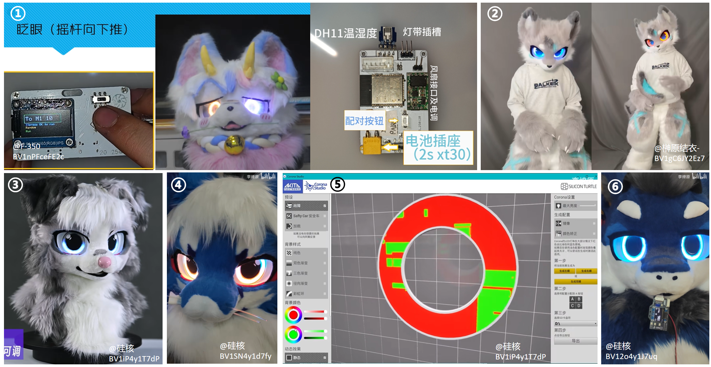

# LedEyesForFursuit——开源兽装电子发光眼
 Designed by [@FlyingMeow](https://space.bilibili.com/651746680), for electric eyes on fursuit

设计人：[@雪山飞喵ovo](https://space.bilibili.com/651746680)

> 本文引用的图片均已标明来源，如有侵权，请联系删除哦꒰*•ɷ•*꒱

## 项目简介

这个项目是给自家崽子搓的发光电子眼，最早从24年初开始做的，到现在（25年8月）差不多基本的功能都做完了ovo，打算开源出来，如果有感兴趣的小伙伴可以动手复刻，也可以再次基础之上共同做一些改进和尝试！请遵守[开源许可](##开源许可说明)，本方案在遵守该许可的前提下允许商用。

【展示图片&视频】

效果展示

内部连接展示

（目录）

### 项目背景

现有的日系兽装发光眼方案主要有以下几种：

1.  **冷光片方案：** 使用可裁剪的冷光片剪出眼睛虹膜需要的形状，通电即发光。如[@AlZnCuLXT-Leo](https://space.bilibili.com/453770685)制作的发光眼炫酷小狼（下图①②）和[@是沐笙哦](https://space.bilibili.com/88811434)制作的恶魔猫猫[@坏猫咪Noct](https://space.bilibili.com/436821741)（下图③），均采用此种方法，①图所在视频有分享制作方式。这种方案优点在于制作简单，但通常无法改变亮度及颜色。
   
   > ① [你好，我又来发帅帅的兽装发光眼制作方法分享了，冷光片版本~_哔哩哔哩_bilibili](https://www.bilibili.com/video/BV1t8RRYVEWB/)
   >
   > ② [【兽装掉落展示】发光眼炫酷小狼半成品꒰ *•ɷ•* ꒱_哔哩哔哩_bilibili](https://www.bilibili.com/video/BV1z9dhYYELH/)
   >
   > ③ [坏猫咪Noct的动态 - 哔哩哔哩](https://www.bilibili.com/opus/901174724123426819)
   
2.  **遥控灯带方案：** 使用市面上可以直接买到的成品遥控灯带制作发光眼。如[@荒糖乐园](https://space.bilibili.com/386197384)制作的角色（下图①）,可以使用遥控器控制灯带开关及调整亮度；[@梓申_耶加Yirga](https://space.bilibili.com/10738663)进一步使用遥控灯带制作了一款通用的发光眼模块（下图②），可以直接贴在兽头眼睛内侧，对于已经做好兽装但想要加发光眼的毛毛是很好的选择；成品的遥控灯带在某宝有售（下图③）。这种方案优点在于制作简单、且可以根据遥控器或手机APP设定改变发光眼颜色及亮度，但动态效果比较单一，而且使用遥控器的按键操作方式对单人出毛不是很友好，通常需要有陪同来操作。[@Real_Even_](https://space.bilibili.com/824087)与[@是沐笙哦](https://space.bilibili.com/88811434)制作的发光眼兽装结合手机端的语音识别功能实现了对发光眼的语音控制（下图④），推测也是类似于使用遥控灯带的方案。

   > ① [【兽装制作】【收录角色：06】PartA:兽装发光眼睛__哔哩哔哩_bilibili](https://www.bilibili.com/video/BV15Q4y1C7fj/)
   >
   > ② [发光眼定制方式&使用教程__哔哩哔哩_bilibili](https://www.bilibili.com/video/BV1oN41187zT/?vd_source=3d0e286d695b61ee17471629138cb89e)
   >
   > ④ [兽装贾维斯，解放双手，无需陪同_哔哩哔哩_bilibili](https://www.bilibili.com/video/BV1XDiyYVE8X/)

3.  **MCU+可编程灯珠方案：** 使用微处理器(MCU)和可编程控制的RGB三色LED灯制作发光眼。如[@F-350](https://space.bilibili.com/478983938)制作的发光眼（下图①），包括一个控制主板和一个交互终端（均使用ESP32-WROOM单片机），可以实现颜色切换功能和眨眼等动态效果；[@榊原结衣-](https://space.bilibili.com/3072475)也实现了类似的发光眼（下图②），可由APP操控切换颜色并实现一些动态效果。我认为目前发光眼实现效果最好、最成熟的方案是由[@硅核](https://space.bilibili.com/489787289)设计的可编程发光眼（下图③④），可以通过配套的发光眼编辑器_Corona Studio_自定义设置动态效果（下图⑤），同时也设计了相应的语音控制方案（下图⑥）。这种方案优点在于定制化程度高，可由MCU实时控制各个灯珠的RGB颜色，从而实现各种各样的动态效果，同时结合MCU的外设接口可以实现多种交互方式；缺点在于定制化过程复杂、制作门槛高，目前还没有较为成熟的开源方案。
   

   > ① [兽装发光眼＆内置风扇介绍__哔哩哔哩_bilibili](https://www.bilibili.com/video/BV1nPFceFE2c/?spm_id_from=333.337.search-card.all.click&vd_source=3d0e286d695b61ee17471629138cb89e)
   >
   > ② [今年最后的一个委托 是个伪全 可以app操控换色的发光眼 直视我的眼睛！！_哔哩哔哩_bilibili](https://www.bilibili.com/video/BV1gC6JY2Ez7/?spm_id_from=333.337.search-card.all.click&vd_source=3d0e286d695b61ee17471629138cb89e)
   >
   > ③ [【兽装】可以眨眼的兽装！陨石边牧掉落展示__哔哩哔哩_bilibili](https://www.bilibili.com/video/BV1MT411X7Hb/)
   >
   > ④ [故障效果__哔哩哔哩_bilibili](https://www.bilibili.com/video/BV1SN4y1d7fy)
   >
   > ⑤ [【兽装】发光眼编辑器Corona Studio使用教程_哔哩哔哩_bilibili](https://www.bilibili.com/video/BV1iP4y1T7dP/)
   >
   > ⑥ [你好，VIR。_哔哩哔哩_bilibili](https://www.bilibili.com/video/BV12o4y1J7uq)

本项目使用**MCU+可编程灯珠方案**，MCU使用ESP32-WROOM-32E，可编程灯珠使用WS2812B，同时使用ASRPRO模组进行语音指令识别。希望可以为有兴趣自制发光眼的毛毛们提供一些参考！

### 项目内容

项目开源内容包括：

- 发光眼主控板及灯板的PCB设计（使用立创EDA专业版设计）
- 发光眼外壳的结构设计工程及模型文件（使用Solidworks设计）
- 发光眼的ESP32固件程序源码（使用VScode PlatformIO开发框架）
- ASRPRO语音识别程序的`.hd`文件（使用ASRPRO开发工具天问Bolck）

## 功能介绍

### 基本功能

1. 语音唤醒反馈：识别到唤醒词**飞喵飞喵**后，会眨一下眼睛作为反馈，同时板上LED7闪烁两次。
2. 眨眼睛效果：触发后，发光眼灯板的灯珠从上到下依次熄灭，再从下到上依次亮起，模拟“眨眼睛”的效果。
3. 呼吸灯效果：实现眼睛整体亮度渐亮、渐暗的呼吸灯效果。
4. 亮度调节：由语音指令或蓝牙指令调节发光眼整体亮度。
5. 颜色切换：自动切换眼睛颜色或由语音指令切换。
6. 模式切换：切换“蹦迪模式”、“舒缓模式”、“普通模式”，执行一组预设指令组合。
7. 风扇控制：通过语音指令控制内置风扇开关。

### 交互逻辑

各功能及模式切换可由**蓝牙串口指令**或**语音指令**进行控制：

- 蓝牙串口指令见 [附录1](##附录1 蓝牙交互指令汇总)
- 语音指令见 [附录2](##附录2 语音交互指令汇总)
- 蓝牙串口使用方法见 [附录3](##附录3 蓝牙串口使用方法)

## 硬件设计方案

### 电路设计

### 结构设计

## 软件设计方案

### 程序架构

### 交互逻辑的实现

缺点：代码比较冗长

## 后续开发ideas

硬件设计方面：

软件功能方面：

- MPU6050
- 光敏电阻
- 手机端上位机
- 音频节奏识别
  - 输入音量饱和

## 开源许可说明

**【注意】**开源内容**不包括**演示使用的兽装角色形象设计，即**“雪山飞喵”**兽设形象的物种设定、造型设计、配色及花纹设计，其唯一所有者[@雪山飞喵ovo](https://space.bilibili.com/651746680)拥有该形象的著作权及使用权，任何未经授权的使用属于侵权行为。如果您想复刻本项目，请使用您的**原创**角色设定形象。

## 附录1 蓝牙交互指令汇总

（表格）

## 附录2 语音交互指令汇总

（表格）

【注】：ASRPRO目前暂不支持英文单词和字母的语音识别，仅限识别汉字。

## 附录3 蓝牙串口使用方法

1. 使用手机蓝牙查找发光眼设备并连接、配对

2. 使用蓝牙串口调试助手APP连接发光眼设备

3. 向发光眼设备下发蓝牙串口指令

