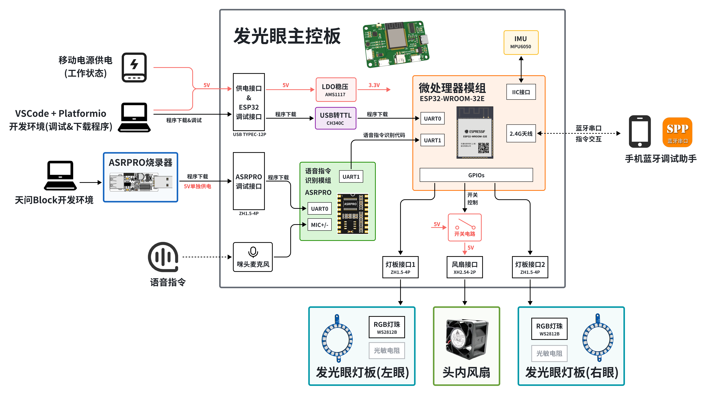

# LedEyesForFursuit——开源兽装电子发光眼
 Designed by [@FlyingMeow](https://space.bilibili.com/651746680), for electric eyes on fursuit

设计人：[@雪山飞喵ovo](https://space.bilibili.com/651746680)

> 本文引用的图片均已标明来源，如有侵权，请联系删除哦꒰*•ɷ•*꒱

**【注意】** 本项目开源内容**不包括**演示使用的兽装角色形象设计，即 **“雪山飞喵”** 兽设形象的物种设定、造型设计、配色及花纹设计，其唯一所有者[@雪山飞喵ovo](https://space.bilibili.com/651746680)拥有该形象的著作权及使用权，任何未经授权的使用属于侵权行为。如果您想复刻本项目，请使用您的 **原创** 角色设定形象。

---

## 项目简介

这个项目是给自家崽子搓的发光电子眼，最早从24年初开始做的，到现在（25年8月）差不多基本的功能都做完了ovo，打算开源出来，如果有感兴趣的小伙伴可以动手复刻，也可以再次基础之上共同做一些改进和尝试！请遵守[开源许可](##开源许可说明)，本方案在遵守该许可的前提下允许商用。

成品效果：（是下面这只白黄橘猫猫！😽）

可以通过语音控制发光眼的灯光：
【语音控制演示视频】

头内发光眼设备包括一个主控板、两个发光眼灯板（配套外壳），以及一个头内风扇。

### 项目背景

现有的日系兽装发光眼方案主要有以下几种：

1.  **冷光片方案：** 使用可裁剪的冷光片剪出眼睛虹膜需要的形状，通电即发光。如[@AlZnCuLXT-Leo](https://space.bilibili.com/453770685)制作的发光眼炫酷小狼（下图①②）和[@是沐笙哦](https://space.bilibili.com/88811434)制作的恶魔猫猫[@坏猫咪Noct](https://space.bilibili.com/436821741)（下图③），均采用此种方法，①图所在视频有分享制作方式。这种方案优点在于制作简单，但通常无法改变亮度及颜色。
   
   > ① [你好，我又来发帅帅的兽装发光眼制作方法分享了，冷光片版本~_哔哩哔哩_bilibili](https://www.bilibili.com/video/BV1t8RRYVEWB/)
   >
   > ② [【兽装掉落展示】发光眼炫酷小狼半成品꒰ *•ɷ•* ꒱_哔哩哔哩_bilibili](https://www.bilibili.com/video/BV1z9dhYYELH/)
   >
   > ③ [坏猫咪Noct的动态 - 哔哩哔哩](https://www.bilibili.com/opus/901174724123426819)
   
2.  **遥控灯带方案：** 使用市面上可以直接买到的成品遥控灯带制作发光眼。如[@荒糖乐园](https://space.bilibili.com/386197384)制作的角色（下图①）,可以使用遥控器控制灯带开关及调整亮度；[@梓申_耶加Yirga](https://space.bilibili.com/10738663)进一步使用遥控灯带制作了一款通用的发光眼模块（下图②），可以直接贴在兽头眼睛内侧，对于已经做好兽装但想要加发光眼的毛毛是很好的选择；成品的遥控灯带在某宝有售（下图③）。这种方案优点在于制作简单、且可以根据遥控器或手机APP设定改变发光眼颜色及亮度，但动态效果比较单一，而且使用遥控器的按键操作方式对单人出毛不是很友好，通常需要有陪同来操作。[@Real_Even_](https://space.bilibili.com/824087)与[@是沐笙哦](https://space.bilibili.com/88811434)制作的发光眼兽装结合手机端的语音识别功能实现了对发光眼的语音控制（下图④），推测也是类似于使用遥控灯带的方案。

   > ① [【兽装制作】【收录角色：06】PartA:兽装发光眼睛__哔哩哔哩_bilibili](https://www.bilibili.com/video/BV15Q4y1C7fj/)
   >
   > ② [发光眼定制方式&使用教程__哔哩哔哩_bilibili](https://www.bilibili.com/video/BV1oN41187zT/?vd_source=3d0e286d695b61ee17471629138cb89e)
   >
   > ④ [兽装贾维斯，解放双手，无需陪同_哔哩哔哩_bilibili](https://www.bilibili.com/video/BV1XDiyYVE8X/)

3.  **MCU+可编程灯珠方案：** 使用微处理器(MCU)和可编程控制的RGB三色LED灯制作发光眼。如[@F-350](https://space.bilibili.com/478983938)制作的发光眼（下图①），包括一个控制主板和一个交互终端（均使用ESP32-WROOM单片机），可以实现颜色切换功能和眨眼等动态效果；[@榊原结衣-](https://space.bilibili.com/3072475)也实现了类似的发光眼（下图②），可由APP操控切换颜色并实现一些动态效果；我认为目前发光眼实现效果最好、最成熟的方案是由[@硅核](https://space.bilibili.com/489787289)设计的可编程发光眼（下图③④），可以通过配套的发光眼编辑器 _Corona Studio_ 自定义设置动态效果（下图⑤），同时也设计了相应的语音控制方案（下图⑥）。这种方案优点在于功能自由度高，可由MCU实时控制各个灯珠的RGB颜色，从而实现各种各样的动态效果，同时结合MCU的外设接口可以实现多种交互方式；缺点在于定制化过程复杂、制作门槛高，目前还没有较为成熟的开源方案。
   

   > ① [兽装发光眼＆内置风扇介绍__哔哩哔哩_bilibili](https://www.bilibili.com/video/BV1nPFceFE2c/?spm_id_from=333.337.search-card.all.click&vd_source=3d0e286d695b61ee17471629138cb89e)
   >
   > ② [今年最后的一个委托 是个伪全 可以app操控换色的发光眼 直视我的眼睛！！_哔哩哔哩_bilibili](https://www.bilibili.com/video/BV1gC6JY2Ez7/?spm_id_from=333.337.search-card.all.click&vd_source=3d0e286d695b61ee17471629138cb89e)
   >
   > ③ [【兽装】可以眨眼的兽装！陨石边牧掉落展示__哔哩哔哩_bilibili](https://www.bilibili.com/video/BV1MT411X7Hb/)
   >
   > ④ [故障效果__哔哩哔哩_bilibili](https://www.bilibili.com/video/BV1SN4y1d7fy)
   >
   > ⑤ [【兽装】发光眼编辑器Corona Studio使用教程_哔哩哔哩_bilibili](https://www.bilibili.com/video/BV1iP4y1T7dP/)
   >
   > ⑥ [你好，VIR。_哔哩哔哩_bilibili](https://www.bilibili.com/video/BV12o4y1J7uq)

本项目使用**MCU+可编程灯珠方案**，MCU使用ESP32-WROOM-32E，可编程灯珠使用WS2812B，同时使用ASRPRO模组进行语音指令识别。希望可以为有兴趣自制发光眼的毛毛们提供一些参考！🐱

### 项目内容

项目开源内容包括：

- 发光眼主控板及灯板的PCB设计（使用立创EDA专业版设计）
- 发光眼外壳的结构设计工程及模型文件（使用Solidworks设计）
- 发光眼的ESP32固件程序源码（使用VScode PlatformIO开发框架）
- ASRPRO语音识别程序的`.hd`文件（使用ASRPRO开发工具天问Bolck）

## 功能介绍

### 基本功能

1. 语音唤醒反馈：识别到唤醒词**飞喵飞喵**后，会眨一下眼睛作为反馈，同时板上LED7闪烁两次。
2. 眨眼睛效果：触发后，发光眼灯板的灯珠从上到下依次熄灭，再从下到上依次亮起，模拟“眨眼睛”的效果。
3. 呼吸灯效果：实现眼睛整体亮度渐亮、渐暗的呼吸灯效果。
4. 亮度调节：由语音指令或蓝牙指令调节发光眼整体亮度。
5. 颜色切换：自动切换眼睛颜色或由语音指令切换。
6. 模式切换：切换“蹦迪模式”、“舒缓模式”、“普通模式”，执行一组预设指令组合。
7. 风扇控制：通过语音指令控制内置风扇开关。

### 交互逻辑

各功能及模式切换可由**蓝牙串口指令**或**语音指令**进行控制：

- 蓝牙串口指令见 [附录1](##附录1-蓝牙交互指令汇总)
- 语音指令见 [附录2](##附录2-语音交互指令汇总)
- 蓝牙串口使用方法见 [附录3](##附录3-蓝牙串口使用方法) 

## 硬件设计方案

### 电路设计

硬件电路设计方案如下图所示：主控板MCU使用ESP32-WROOM-32E，板上集成CH340C用于程序下载，由ESP32的GPIO控制发光眼灯板上的WS282B灯珠、经MOS管开关电路控制头内风扇开关。主控板上集成的ASRPRO模组使用UART接口与ESP32通信。主控板上还集成了一个MPU6050传感器。

各模块实物连接如下图所示：

发光眼主控板的供电方式如下图所示：工作电压分5V和3.3V两种。在系统工作时，由移动电源进行全局供电；在ESP32程序下载时，由电脑USB口进行全局供电；在ASRPRO程序下载时，经ASRPRO烧录器只给ASRPRO模组部分进行局部供电。

ESP32所用引脚及功能如下表所示：

| 引脚序号 | MCU引脚 | 功能                            |
| -------- | ------- | ------------------------------- |
| 34       | RXD0    | ESP32下载程序，连接CH340C TXD   |
| 35       | TXD0    | ESP32下载程序，连接CH340C RXD   |
| 27       | IO16    | 连接ASRPRO PA2                  |
| 28       | IO17    | 连接ASRPRO PA3                  |
| 24       | IO2     | 连接WS2812灯带数据输入引脚 左眼 |
| 26       | IO4     | 连接WS2812灯带数据输入引脚 右眼 |
| 30       | IO18    | 连接MPU6050 SCL                 |
| 31       | IO19    | 连接MPU6050 SDA                 |
| 7        | IO35    | LED指示灯-红色                  |
| 8        | IO32    | LED指示灯-绿色                  |
| 9        | IO33    | LED指示灯-蓝色                  |
| 10       | IO25    | 光敏电阻ADC输入 左眼            |
| 11       | IO26    | 光敏电阻ADC输入 右眼            |
| 12       | IO27    | 风扇供电控制                    |

关于主控板及灯板的PCB设计，参见OSHWHub开源工程。

### 结构设计

硬件电路设计完后，需要设计发光眼外壳及其内部结构，以贴合头骨眼眶、固定防尘网眼片和发光眼灯板。

发光眼结构设计如上图所示，依次包括以下几个部分：

- **① 头骨-眼眶连接件：** 使用白色材料打印，通过热熔胶固定在头骨眼眶处。
- **② 眼片连接中间结构（眼眶）：** 使用白色材料打印，作为眼眶部分的主体，其深度影响追踪眼效果。
- **③ 匀光片：** 使用白色材料打印，用于分散灯珠的光线，其厚度可依据实际情况调整。防尘网眼片安装在结构②和结构③之间
- **④ 灯板外壳：** 使用黑色材料打印，用于将灯板和匀光片拉开合适的距离。
- **⑤ 灯板：** 安装时先将灯板PCB扣在⑥遮光盖板上，光敏电阻焊接时可留出一点长度，弯到⑥的开口上。
- **⑥ 遮光盖板：** 使用黑色材料打印，用于遮住反射过来的灯光，并把灯光聚集在瞳孔外的环形区域。

需要注意：结构①及后续眼眶的形状可能需要根据不同头骨的眼眶形状设计，本模型不一定能适应各种形状的头骨。这里仅提供一种设计思路的分享。我的设计流程如下：

1. 使用非参数化3D建模软件（如Nomad等）捏脸、抽壳、挖孔修出合适的头骨形状，导出STL文件。
2. 导入头骨STL文件到3D打印切片软件（如Bambu Studio等），缩放调整至合适尺寸，再导出STL文件。
3. 将调整尺寸后的头骨STL文件导入参数化3D建模软件（如Solidworks或Fusion360等）。
4. 先建模结构①：先选取合适位置的建模基准面，在该平面新建草图并绘制贴合眼眶形状的样条曲线（略大一圈）和定位孔，再拉伸成型到头骨内表面。
5. 最后依据该眼眶外形进行后续结构②~⑥的建模。

安装前，在①的3个固定孔处和②的2个固定孔处埋入M3热熔螺母，再将①用热熔胶固定到头骨上，如下图所示：

将发光眼各部分按顺序组装，使用M3螺丝、②的两个热熔螺母压紧固定，如下图所示：

最后用M3螺丝将发光眼安装到已固定到头骨眼眶部位的结构①上，再固定主控板及头内风扇，安装好后如下图所示：

## 软件设计方案

### 程序架构

发光眼的软件程序的核心在于如何计算和处理每一个LED灯的RGB颜色。为了保证颜色、亮度、动态变化等各个效果的控制互不干扰，设计了如下图所示的多级处理架构：各级之间的颜色信息处理由`task`进行，分级处理各个效果，对LED的颜色赋值和刷新由最后一个任务`taskEyesBlink`统一进行。程序中，对WS2812灯珠的控制使用了`FastLED`库。程序代码见`include/led_tasks.h`与`src/led_tasks.cpp`。

### 交互逻辑的实现

蓝牙串口指令交互功能在`src/ble_msg_hdl.cpp`实现。

语音控制功能在`src/voice_msg_hdl.cpp`实现。

## 后续开发ideas

硬件设计方面：

- LED IO问题：IO34 IO35貌似不能正常使用？
- 加升压电路到12V，使用PWM控制4线风扇

软件功能方面：

- MPU6050
- 光敏电阻
- 手机端上位机
- 音频节奏识别
  - 输入音量饱和

## 开源许可说明

**【注意】**开源内容**不包括**演示使用的兽装角色形象设计，即**“雪山飞喵”**兽设形象的物种设定、造型设计、配色及花纹设计，其唯一所有者[@雪山飞喵ovo](https://space.bilibili.com/651746680)拥有该形象的著作权及使用权，任何未经授权的使用属于侵权行为。如果您想复刻本项目，请使用您的**原创**角色设定形象。

## 附录1-蓝牙交互指令汇总

## 附录2-语音交互指令汇总

【注】：ASRPRO目前暂不支持英文单词和字母的语音识别，仅限识别汉字。

## 附录3-蓝牙串口使用方法

1. 使用手机蓝牙查找发光眼设备并连接、配对

2. 使用蓝牙串口调试助手APP连接发光眼设备

3. 向发光眼设备下发蓝牙串口指令

